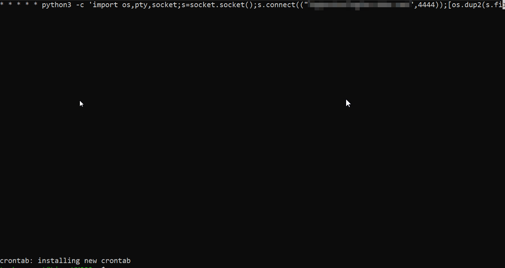
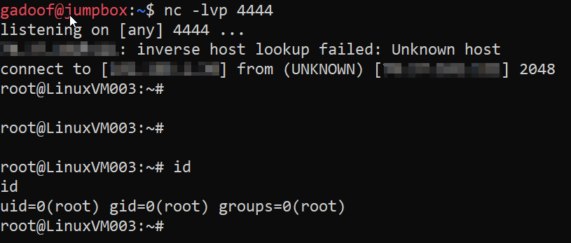
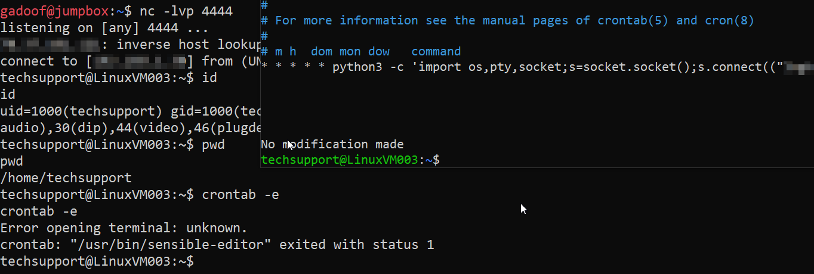

# EDR Bypass against MDE on Ubuntu 20.04
#### this was written by a human

### Looking into some potential EDR bypass techniques against Microsoft Defender for Endpoint specifically on Ubuntu 20.04. 

I've been really interested in looking into bypass techniques ever since I got into cybersecurity, and I remember when I was a junior pentester, the general notion was that EDR was an advanced form of Antivirus (AV) and it was changing the game in terms of adding complexity to the cyber kill chain, giving defenders an increased chance of success. 

Eventually, I found out that really, all it takes is a dedicated attacker to perform recon against a target, determine the EDR that the target is using, and then to spend some dev time researching a bypass. I was under the impression that this took quite a bit of resources, especially when talking about some of the better EDR solutions out there. From what I could tell, these included Crowdstrike, Microsoft, Cylance, CarbonBlack, Trend Micro, SentinelOne and a few others depending on who you talk to. 

This reminds me of the _Big Short_...everyone assumes **EDR** is good, but nobody really looks into it. So, let's actually take a look at one of the bigger EDR's on the market and how well they're doing defending Linux operating systems, starting specifically with Ubuntu 20.04.

##### **_Let's get it!!!_**

##### [Fastest TLDR](https://github.com/Gadoof/Gadoof/blob/main/mde_bypass_cron.md#conclusion) 

# Target

- Debian Ubuntu 20.04
- Fully updated
- Tested on Default Image in Azure and On-Prem
- Valid as of 8/11/23


### Kernal Information:
```
techsupport@LinuxVM003:~$ uname -a
Linux LinuxVM003 5.15.0-1042-azure #49~20.04.1-Ubuntu SMP Wed Jul 12 12:44:56 UTC 2023 x86_64 x86_64 x86_64 GNU/Linux
```
### MDE Config on Endpoint:

This is as secure as I can get the MDE EDR to be configured, and as this is just a test environment w/o any real automation tools like GPO, Intune, etc. I had to enable behavior_monitoring as that isn't enabled by default, and thus MDE by default w/o any tools doesn't actively block by default but instead acts in a passive config, noting malicious code in Defender portal, but allowing it to run.

Enabling behavior_monitoring changed the config to a more *active* configuration, blocking anything that it deems malicious.

Tamper protection is not supported on Linux, and wouldn't make a difference afaiu. 

```
techsupport@LinuxVM003:~$ mdatp health
healthy                                     : true
health_issues                               : []
licensed                                    : true
engine_version                              : "1.1.23070.1002"
app_version                                 : "101.23062.0010"
org_id                                      : "b6cafe3e-bf50-4d8d-829a-d68b3fd21827"
log_level                                   : "info"
machine_guid                                : "ae672b31-45db-467e-a9be-401284530c07"
release_ring                                : "Production"
product_expiration                          : Apr 10, 2024 at 01:34:28 PM
cloud_enabled                               : true
cloud_automatic_sample_submission_consent   : "safe"
cloud_diagnostic_enabled                    : false
passive_mode_enabled                        : false
behavior_monitoring                         : "enabled"
real_time_protection_enabled                : true
real_time_protection_available              : true
real_time_protection_subsystem              : "fanotify"
supplementary_events_subsystem              : "auditd"
tamper_protection                           : "disabled"
automatic_definition_update_enabled         : true
definitions_updated                         : Aug 12, 2023 at 03:26:24 AM
definitions_updated_minutes_ago             : 159
definitions_version                         : "1.395.227.0"
definitions_status                          : "up_to_date"
edr_early_preview_enabled                   : "disabled"
edr_device_tags                             : []
edr_group_ids                               : ""
edr_configuration_version                   : "30.199999.icm411710458.2023.08.10.04-54CD2DC991A7EBDEECB7784DAEEF452E6527FEC2BDC3983DD35212875E773F
34"
edr_machine_id                              : "94cb840531fd5d9f8031cd26317eed0c72b08d7e"
conflicting_applications                    : []
network_protection_status                   : "stopped"
network_protection_enforcement_level        : "disabled"
troubleshooting_mode                        : false
```

# The Goal?

## Find a Bypass

Normally what I'd prepare to do here is attempt encoding/obfuscation techniques, memory techniques, you know, some extracarricular **wizardry**, but in this writeup I want to show what I found after some extremely basic testing. This didn't take any effort at all. I have no idea what I'm doing and again, from what I understand, _this shouldn't be possible_. 

## The Technique

TLDR: It's extremely basic; all I'm doing here is utilizing an extremely common persistence technique utilizing cronjob (crontab -e) to force the system to run a very basic, unencoded python reverse shell. This works with standard user permissions. Nothing else is required to get this to work.

Normally during an engagement, attackers have specific methodologies that they attempt to do depending on what step of the process they're on. When we land on a machine after finding and exploiting a vulnerability, one of the first objectives is to setup persistence. Persistence allows an attacker to stay on a machine, regardless of what happens to their current shell or access to that machine. This is extremely common because an attacker that loses their shell could lose access to the machine forever, especially if the exploit is considered unstable, for instance when an exploit corrupts memory (buffer overflows and the like). 

On the linux operating system, applications and system administrators would both utilize cronjobs to automate running code or binaries at specific intervals of their choosing. This allows for simple automation on Linux, and is very effective. For these reasons, [attackers utilize cron to potentially hide in plain sight](https://attack.mitre.org/techniques/T1053/003/). From a pentesting perspective, we're not necessarily worried about getting caught by monitoring tools, but EDR may be potentially in the way...and now we're full circle as to why I was testing this. 

I wanted to see if a really well known and highly praised EDR solution from Microsoft would see some really basic techniques, just to cover my bases before moving into more complicated techniques. I had never done this type of work before so I was never exactly sure where the EDR utilities ended and where the bypass techniques began, but the information that I've found is, to be honest, highly suspect. 

## The Rub

TLDR: I don't understand. This process is extremely well known to attackers, and is extremely common; forcing the system to run malicious code. It's so common, that I'd say it's one of the first things that are tried, as in it's _already built into the attackers' process_. I'm not 100% on how the EDR is failing this check on the malicious code being ran by cron, but if it's due to it being called by system via cron, there are likely many other bypass techniques that are just waiting to be found.

It's **completely possible** that I don't understand the complexity of what the EDR is capable of on Linux, but what I do know is that the code itself, is without a doubt, malicious. It gets caught when it runs on terminal, so why doesn't it get caught when ran in cron?

Essentially, there are a couple things happening here. It is entirely possible (read _extremely_ likely) that I have no idea what I'm talking about and this methodology of execution is something that an EDR either cannot or decides not to block for some very obvious reason...This sounds the most likely because I'm truly shocked that MDE would allow something like this. However...I also highly doubt this is by design just because of how simple this bypass technique is. It essentially makes EDR useless (debatable, obviously).

It's also entirely possible that this is a well known bypass technique against MDE and is being actively used to bypass the EDR solution from Microsoft. Remember, this is Advanced Threat Protection (ATP, the old name for MDE)...Microsoft's enterprise EDR solution for Linux.

Now, I've already seen a couple comments online saying that MDE is best on Windows, so expecting the EDR solution from Microsoft to be amazing on Linux is a non-starter.

But that leads me to my main question; if this is Microsoft's best offer for EDR for Linux operating systems, and [we know that Azure uses Linux as it's base operating system for it's cloud services](https://thehackernews.com/2015/09/microsoft-linux-azure-cloud-switch.html) and this is from 2015. If Azure is comprised of Linux operating systems that are defended by Microsoft, are they not defending these services with EDR? And if they are, are they using MDE? It would not be a good look if they were using a competitor, or even worse if they decided that they don't need to utilize defense in depth so have opted to forego EDR on their Azure service hosts. If they _ARE_ using MDE on their Azure services...

Either way, more questions come up then answers, and I'm interested in hearing from anyone who may know more about this. Feel free to let me know I'm missing something and am way off base, I hope I am.

```
Ping me on Discord: @Gadoof
```

## More Technical Stuff/Images
##### probably wrong mostly, grain of salt

If I had to guess the EDR isn't monitoring for execution by system, so the bypass is working by running the malicious code by the system via cron.

Below are some testing I performed against the target to verify what was getting caught.

#### _EDR Block_


#### _EDR Block_


#### Setting same command in Cron; **BYPASS**


#### Bypass found with Cron method; **BYPASS**


#### Tested new awk reverse shell code with sudo permissions to verify it's not about sudo/root; _EDR Block_


#### Tested the same python command as earlier that worked in cron; _EDR Block_


#### Tested again to verify Cron bypass, used only user permissions; **BYPASS**


### More Fun Testing

#### Tested to see if anything weird was happening to the process calling the malicious code


Nothing odd going on, no obfuscation of the code in the process. EDR should be able to see this code being called. Noticed that the process being called is /sbin/init. It is possible that by having init.d call your crontab that this is what's calling the malicious code and allowing a bypass to occur. 

If you've seen network adapters in the OS stack before, they are typically described as having different 'elevations.' An adapter closer to the bottom comes into contact with the packets first, so if those packets are manipulated, an adapter at a higher elevation wouldn't notice. Similarly I think that what's happening here is that the init.d process is above the EDR hooks, thus preventing EDR from detecting it.

On another kali distro it was being called by /usr/sbin/cron. This may be what matters for the EDR catch...

### Tested to see if this works on another target

# Second Target

- Debian Kali 2023.2a
- Fully updated
- Tested On-Prem
- Valid as of 8/22/23

### What's different about this scenario?

This Kali OS calls the two different cron scenarios, either crontab -e or /etc/crontab, using /usr/sbin/cron rather than /usr/init. I'm hoping that this is the major differentiator when trying to understand when this bypass is possible.

#### Verdict thus far

Definitely looks like it depends on how the operating system calls cron, as this Kali OS is unaffected to the bypass technique in way that Ubuntu is. 

# Third Target

- Redhat CentOS 7 2009
- Fully updated
- Tested On-Prem
- Valid as of 8/22/23

### Not Vulnerable

This OS uses /usr/sbin/crond -n to run cron jobs and thus is not vulnerable.


## Conclusion

TLDR: MDE running on Ubuntu or any OS that uses /usr/init to call cron jobs is vulnerable to an EDR bypass technique using cronjobs to run malicious code on the system. 

From my perspective, the EDR should block this code because it is indeed malicious. Defender sees it run when it's ran from the terminal, and the account/permissions that execute the code don't matter. It looks as though ultimately this is a design decision by the OS developer that causes issues for the MDE. The EDR must not be hooking properly to the process when the malicious code is being called by /usr/init. 

This could be considered an _execution context_ issue, a _visibility contraint_ issue, or /usr/init could be considered a _privileged process_. It's possible that this is an issue with MDE in terms of design, or that the the OS devs have created a scenario where the EDR isn't capable of monitoring any calls from /usr/init. 

If anyone has any more detail on this, feel free to ping me on Discord @Gadoof. 


